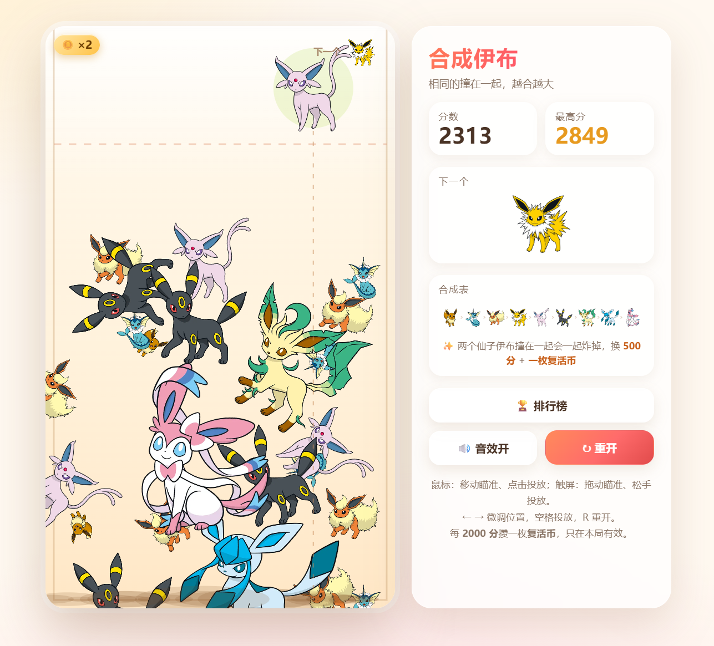

# MergeEevee（合成伊布）

> ⚠️ **Acknowledgements**
>
> 本项目基于 **[yhsome 的《合成大奶娃（BigNaiWa）》](https://github.com/yhsome/BigNaiWa)** 进行二次创作（Derivative Work）。
>
> 本仓库主要进行了：
>
> - 更换为伊布主题素材
> - 调整部分界面与游戏资源
>
> 保留了原项目的核心玩法与物理系统。
>
> 感谢 **yhsome** 的开源分享。
>
> **原项目：**
> GitHub：https://github.com/yhsome/BigNaiWa

---

## 🎮 在线体验

🌐 **MergeEevee**

https://yongmon.github.io/MergeEevee/

支持：

- 💻 Windows / macOS / Linux
- 📱 Android / iPhone
- 📲 可添加到主屏幕作为 Web App

---

## ✨ 游戏特色

- 🍃 伊布家族主题
- 🎨 全部水果替换为伊布及其进化形态
- ⚡ 保留原版物理碰撞体验
- 🏆 在线排行榜
- 📱 支持 PC 与移动端
- 🚀 纯 HTML + CSS + JavaScript，无需安装即可游玩

---

## 🕹️ 游戏玩法

玩法与经典《合成大西瓜》一致：

- 点击（PC）或松手（移动端）投放角色
- 两个相同等级角色碰撞即可合成为下一阶段
- 合成更高级角色获得更高分数
- 当角色堆积超过警戒线并停留一段时间，游戏结束

---

## 📷 游戏截图



---

## 🔄 与原项目相比

目前已完成：

- ✅ 更换伊布主题素材
- ✅ 调整项目名称与部分界面
- ✅ 保留原版物理系统
- ✅ 保留在线排行榜
- ✅ GitHub Pages 在线部署

计划更新：

- ⏳ 宝可梦主题 UI
- ⏳ 更多主题皮肤
- ⏳ 音效优化

---

## 🚀 本地运行

直接打开 `index.html` 即可运行。

如需使用本地服务器：

```bash
python -m http.server 8000
```

然后访问：

```
http://localhost:8000
```

---

## 📂 项目结构

```text
MergeEevee
│
├── assets/
│   └── fruits/          # 伊布素材
├── game.js              # 游戏逻辑
├── style.css            # 页面样式
├── index.html           # 页面入口
├── leaderboard.min.js   # 在线排行榜
├── preview.png          # 游戏截图
└── README.md
```

---

## 🛠️ 技术栈

- HTML5
- CSS3
- JavaScript (ES6)
- Canvas API
- Web Audio API
- LocalStorage

---

## 📄 License

本项目为 **BigNaiWa** 的二次创作项目，请遵守原项目的开源许可证。

Pokémon（宝可梦）、Eevee（伊布）及相关角色版权归 **Nintendo / Game Freak / Creatures Inc.** 所有。

本项目仅供学习、交流及个人非商业用途。